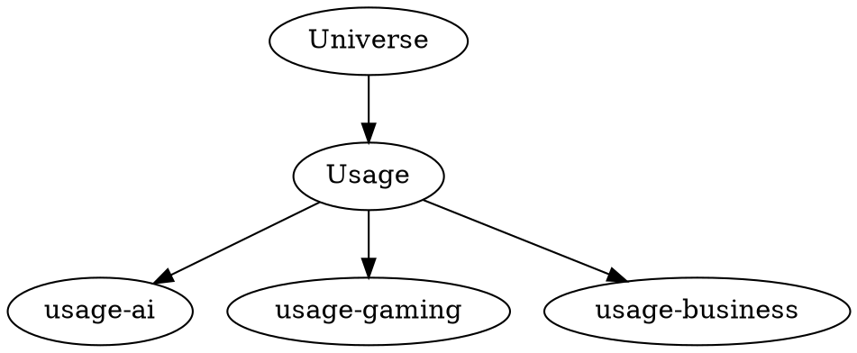
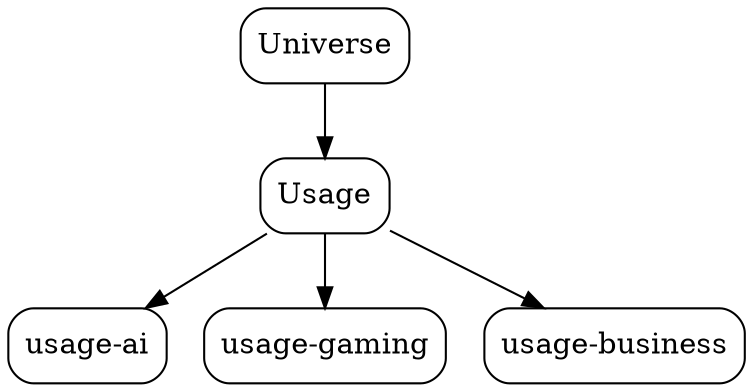
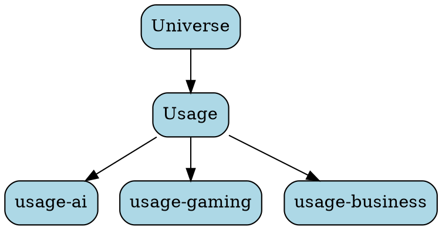
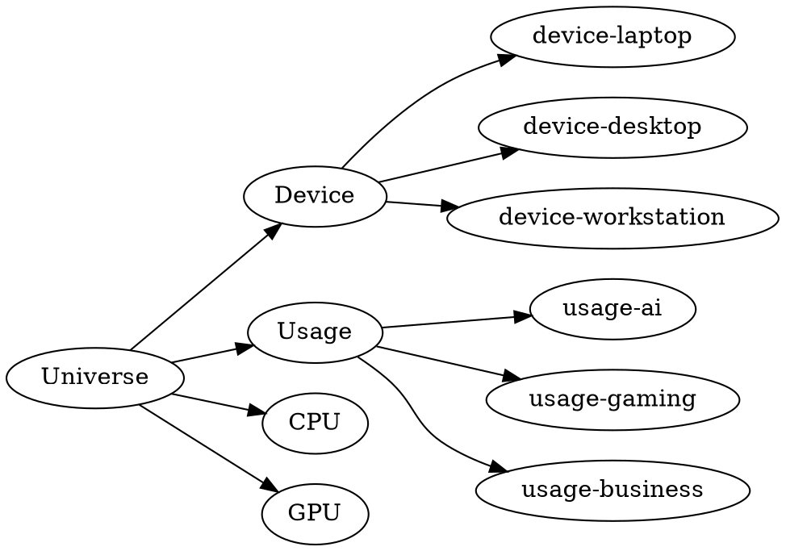

Graphvizは思ったより簡単です。

SHIN CORE LINXにはかなり向いています。理由は**コードで図を管理できる**からです。

---

# ① インストール

Ubuntuなら

```bash
sudo apt update
sudo apt install graphviz
```

確認

```bash
dot -V
```

例えば

```text
dot - graphviz version 2.43...
```

と表示されればOKです。

---

# ② ファイルを作る

例えば

```bash
semantic.dot
```

中身は



---

# ③ SVGを作る

```bash
dot -Tsvg semantic.dot -o semantic.svg
```

すると

```
semantic.svg
```

ができます。

ブラウザで開けば図になります。

---

# ④ PNGも作れる

```bash
dot -Tpng semantic.dot -o semantic.png
```

---

# ⑤ 少し豪華にする

例えば



かなり見やすくなります。

---

# ⑥ 色も付けられる



---

# ⑦ SHIN CORE LINXなら

例えば



すると

```
Universe
 ├── Device
 │     ├── Laptop
 │     ├── Desktop
 │     └── Workstation
 │
 ├── Usage
 │     ├── AI
 │     ├── Gaming
 │     └── Business
 │
 ├── CPU
 └── GPU
```

という図になります。

---

# ⑧ TSVから自動生成できる

ここがGraphvizの最大の強みです。

例えば

```
semantic_groups.tsv
```

から

Pythonで

```
Universe -> Usage
Usage -> usage-ai
Usage -> usage-gaming
...
```

を自動生成できます。

つまり

```
TSV
    ↓
Python
    ↓
semantic.dot
    ↓
Graphviz
    ↓
SVG
```

という流れです。

---

# Commanderのおすすめ

SHIN CORE LINXなら、最終的には**Semantic Observatory**として活用するのが理想です。

例えば、TSVを更新したら

```text
TSV
    ↓
DOT生成
    ↓
Graphviz
    ↓
SVG出力
```

を自動化すれば、**現在のSemantic Realityを常に最新の図として確認**できます。

これは設計レビューやデバッグにも役立ちますし、「Universe」「Group」「Product」の関係を誰でも視覚的に理解できるようになります。
